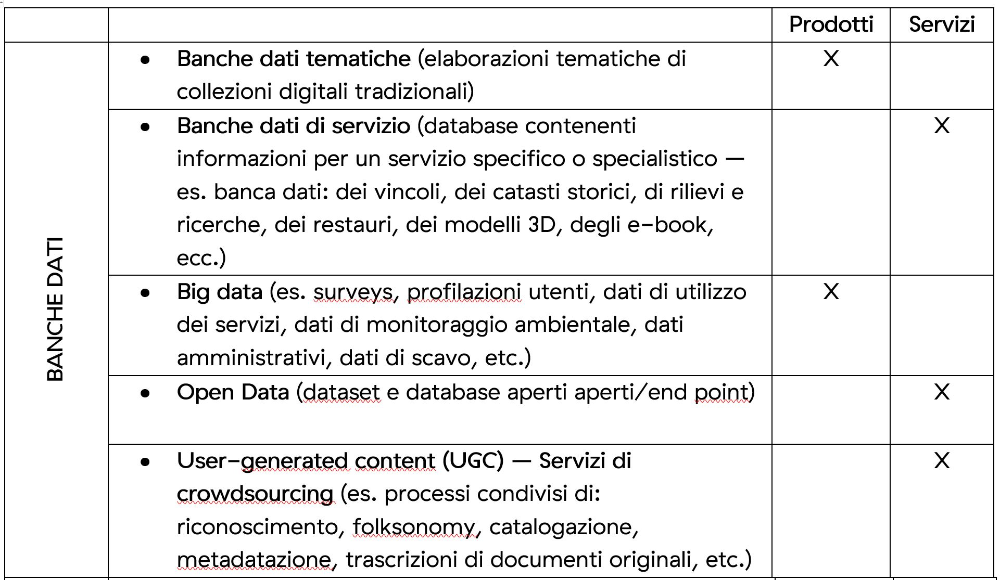
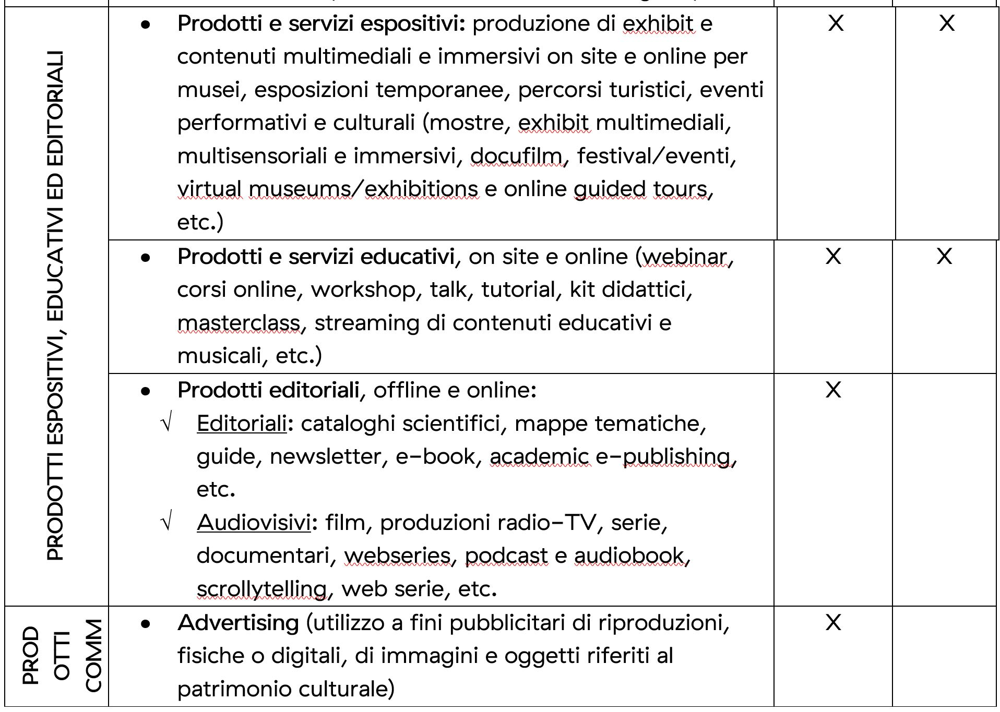
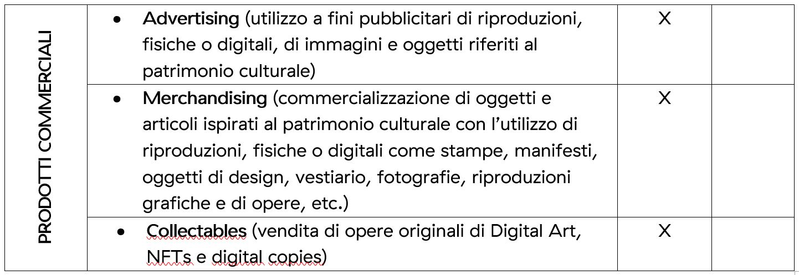

4.3. Prodotti e servizi a valore aggiunto
=========================================

I contenuti messi a disposizione degli utenti possono essere impiegati
nella creazione e nella produzione, sia offline che online, di
**Prodotti e servizi a valore aggiunto**, quali ad esempio: virtual
tours, documentari, film, installazioni, exhibits multimediali,
audioguide, quiz, trivial, giochi, workshop, corsi di formazione online,
soluzioni di *gamification*, edizioni digitali in serie limitata, NFTs,
siti, portali, app, podcast, audiolibri, chatbot, modelli
tridimensionali, etc.

Tali prodotti e servizi possono assumere forme diverse ed essere
destinati a tutte le tipologie di target (B2I, B2B e B2C), in funzione
delle loro esigenze specifiche.

In questa sede è utile operare una distinzione in base alla *finalità* –
piuttosto che in funzione della *forma* – di questi prodotti [13]_ e
servizi, dacché entrambi rappresentano rielaborazioni a valore aggiunto
di contenuti digitali relativi al patrimonio culturale, ovvero:

1. le banche dati,

2. i prodotti espositivi,

3. i prodotti educativi,

4. i prodotti editoriali,

5. i prodotti commerciali (advertising, merchandising, collectables).

La tabella seguente riporta una descrizione dettagliata delle diverse
tipologie individuate tra i *Prodotti e i Servizi a valore aggiunto*,
per facilitarne la comprensione delle loro potenzialità.

**Tabella 3.**\ *Prodotti realizzabili e servizi erogabili in formato
digitale – Prodotti e servizi digitali a valore aggiunto*

|image0|

|image1|

|image2|

Lo sviluppo di tali prodotti e servizi costituisce un’opportunità
fondamentale per gli istituti culturali.

In primis, gli aspetti più importanti derivanti dalla messa a
disposizione delle banche dati sono:

-  Disponibilità, accesso e partecipazione universale degli utenti;

-  Riutilizzo, redistribuzione e interoperabilità sui dati, determinante
   per consentire a fonti diverse di cooperare insieme e includendo la
   possibilità di combinare i dati con altre fonti;

-  Promuovere la conoscenza del settore, rendendo accessibili analisi
   statistiche, ricerche, KPIs, mappe, dashboard e altre informazioni
   scientifiche e consentendo agli utenti di caricare i propri
   dati [14]_.

Inoltre, per quanto attiene ai prodotti espositivi, educativi,
editoriali e commerciali, le opportunità di valorizzazione e
commercializzazione sono pressoché illimitate: molti dei più recenti
sviluppi non esistevano sino a poco tempo fa (es. online guided tours,
on line gaming, webinar, metaversi, NFTs, etc.).

Oltre a garantire introiti aggiuntivi agli istituti culturali, l’offerta
di *Prodotti e servizi a valore aggiunto* permette agli utenti di
confrontarsi e dialogare con il patrimonio culturale con una modalità
diversa (immersiva, coinvolgente, innovativa, stimolante, interattiva,
personalizzata, etc.), attirando nuovi segmenti di pubblico.

.. [13] Si intendono sia prodotti fisici che digitali.

.. [14] Ottimi esempi sono i database open data di National Archive of Data
   on Arts and Culture (NADAC) e Data Arts (Southern Methodist
   University, Dallas), che offrono dati e informazioni sul settore
   culturale e creativo negli Stati Uniti.

