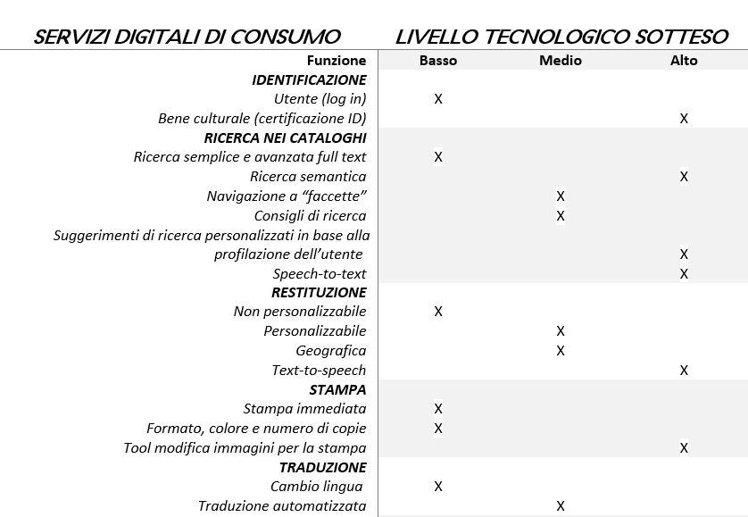
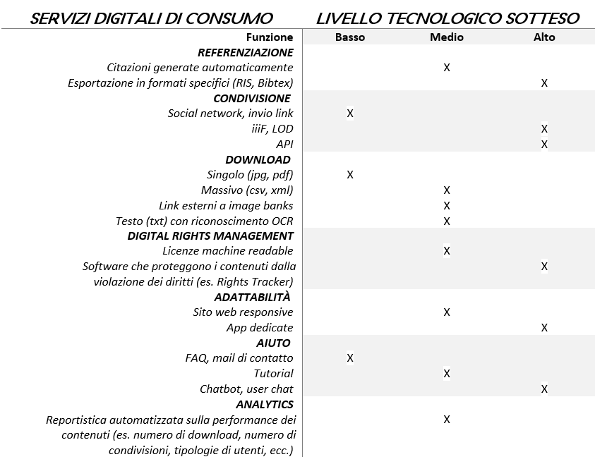

Servizi digitali di consumo
===========================

La prima categoria funzionale di servizi digitali è rappresentata dai
servizi “di consumo” che, nella prospettiva di fruizione dei contenuti
digitali da parte degli utenti, esprimono le possibilità di accedere a
contenuti presenti nei sistemi di pubblicazione online.

In linea generale tali servizi si rivolgono a tutte le tipologie di
target (B2I, B2B e B2C), anche se i destinatari prioritari sono i
singoli utenti che agiscono privatamente o in funzione del proprio ruolo
professionale o istituzionale (B2C). In questo processo l’utente è
quindi inteso come “consumatore” (*consumer*).

Nella tabella seguente, per facilitare la comprensione di questa
tipologia di servizi e della loro utilità, i servizi digitali di consumo
sono classificati per funzione; per ciascuna di esse è stato fornito un
esempio associato a un determinato livello di complessità della
tecnologia sottostante.

|image0|

|image1|

*Tabella 9. Prodotti realizzabili e servizi erogabili in formato
digitale: Servizi digitali di consumo*

Tali servizi sono in linea di massima già presenti nei siti web degli
istituti culturali nella loro versione “base”; l’evoluzione verso forme
tecnologicamente più avanzate richiede un’attenta valutazione della
capacità di presidio dei singoli istituti [18]_, sia in fase di
progettazione/committenza che in fase di gestione, al fine di offrire
servizi che non nascano obsoleti. Difatti, se nell’opinione comune il
mondo digitale è sempre all’avanguardia – con i suoi software,
dispositivi e piattaforme – l’incessante evoluzione tecnologica comporta
il rischio di un rapido declino dei sistemi sviluppati. Le tecnologie
impiegate per svolgere una determinata funzione (es. conservare
un’immagine in formato digitale) possono “invecchiare” celermente ed
essere sostituite da nuovi formati o soluzioni più avanzate che spesso
non sono più capaci di gestire i dati archiviati in precedenza,
rendendoli inutilizzabili o inaccessibili. Il tema dell’obsolescenza dei
servizi offerti è cruciale e gli istituti dovrebbero considerarla con
attenzione quando valutano le alternative tra le tecnologie *open
source* rispetto alle tecnologie chiuse, oppure tra gli applicativi SaaS
(*Software as a Service*) rispetto ai sistemi proprietari sviluppati
internamente, per individuare le soluzioni che nel medio-lungo periodo
sono più resistenti all’obsolescenza.

.. _Introduzione alla metodologia per la valutazione della maturità digitale degli istituti culturali: https://docs.italia.it/italia/icdp/icdp-pnd-maturita-docs/

.. [18] Cfr. `Introduzione alla metodologia per la valutazione della maturità digitale degli istituti culturali`_, allegato 5 del PND.
