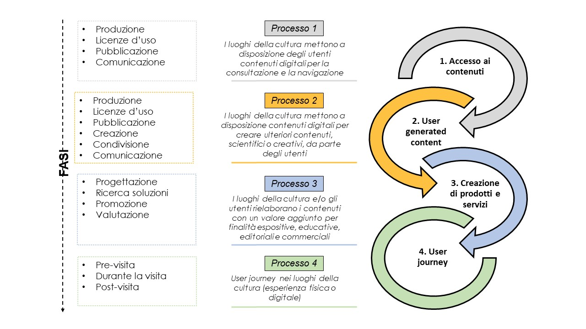

.. _analisi_processi_end-to-end:

L’analisi dei processi end-to-end
=================================

In questa sezione sono analizzati i processi che i luoghi della cultura
possono attivare nel momento in cui rendono fruibili online dati,
risorse e contenuti digitali del patrimonio culturale, secondo i
macro-processi (Fig. 3) prima enunciati, descritti in dettaglio nei
paragrafi seguenti.

|image0|

*Figura 3. Schema di sintesi delle fasi principali dei processi relativi
alla creazione di servizi digitali*

.. toctree::
  :maxdepth: 3
  :numbered:
  :caption: Indice dei contenuti

  lanalisi-dei-processi-end-to-end/processo-1-i-luoghi-della-cultura-mettono-a-disposizione-degli-utenti-contenuti-digitali-per-la-consultazione-e-la-navigazione.rst
  lanalisi-dei-processi-end-to-end/processo-2-i-luoghi-della-cultura-mettono-a-disposizione-degli-utenti-contenuti-digitali-per-creare-nuovi-e-ulteriori-contenuti.rst
  lanalisi-dei-processi-end-to-end/processo-3-i-luoghi-della-cultura-eo-gli-utenti-utilizzano-i-contenuti-digitali-rielaborati-con-un-valore-aggiunto-per-finalità-espositive-educative-editoriali-e-commerciali.rst
  lanalisi-dei-processi-end-to-end/processo-4-user-journey-nei-luoghi-della-cultura.rst

