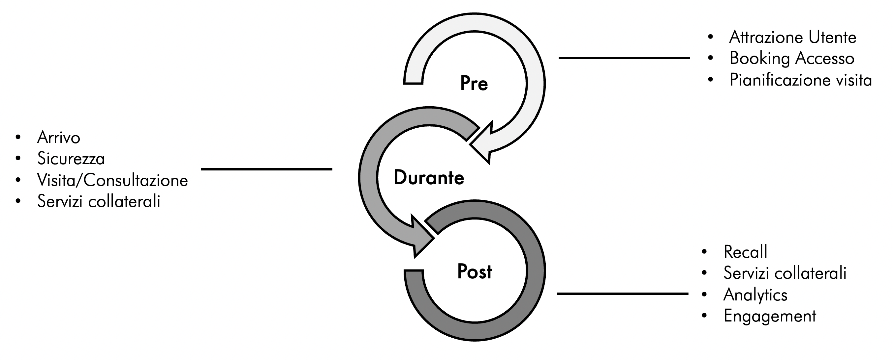
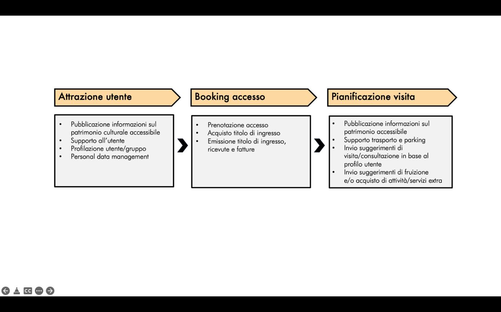
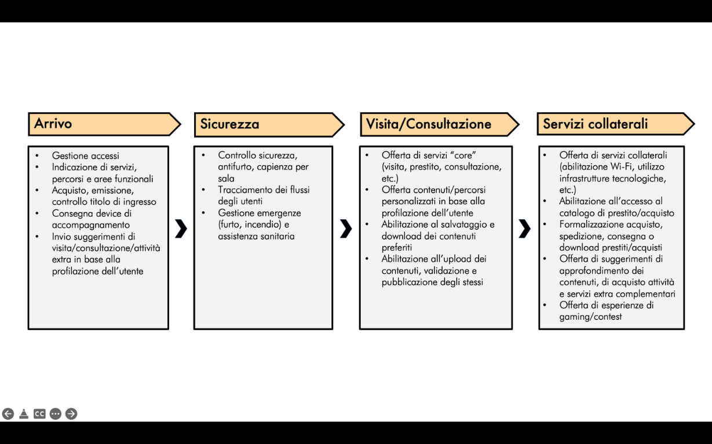
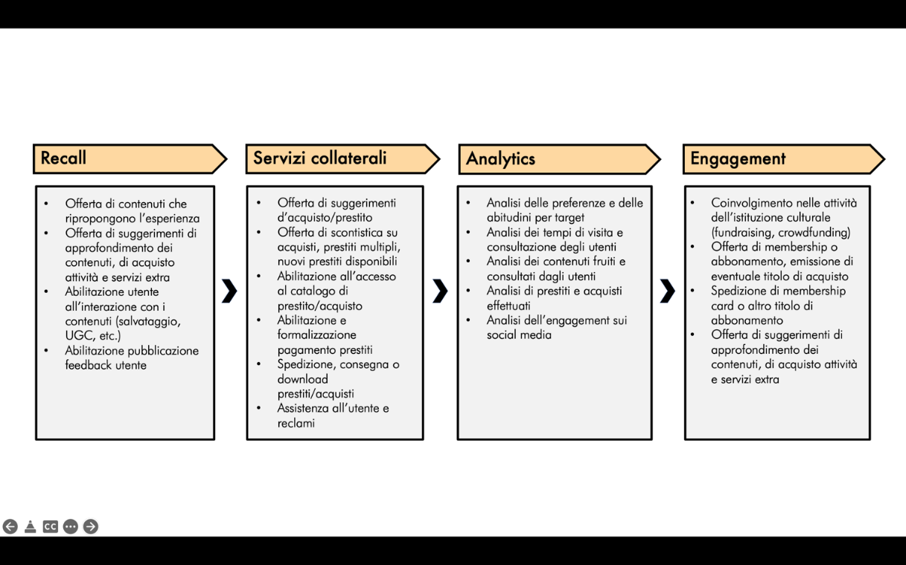

3.4. Processo 4: *User journey* nei luoghi della cultura
========================================================

Per esaminare i processi sottostanti lo *user journey* nei luoghi della
cultura è opportuno rammentare che può realizzarsi sia in una dimensione
*fisica* (es. visita on site a un museo) che *digitale* (es. navigazione
del sito di una biblioteca, fruizione di un prodotto editoriale
realizzato a partire dal riuso dei contenuti digitali, etc.). Ciò
premesso, l’approccio metodologico delinea l’esperienza
dell’utente/visitatore finale in un’analisi strutturata in tre macro
fasi (pre-visita, durante la visita e post-visita), al fine di
supportare i luoghi della cultura nell’identificazione delle opportunità
da cogliere e delle lacune da colmare nella gestione dell’esperienza
dell’utente-visitatore.

Di seguito sono rappresentati i principali processi sottostanti lo *user
journey*, distinguendo tre macro fasi: prima, durante e dopo la visita.
|image0|
**Figura 7.**\ *Mappatura dei processi relativi allo user journey*
|image1|
**Figura 8.**\ *Mappatura dei processi relativi allo user journey – Pre
visita*
|image2|
**Figura 9.**\ *Mappatura dei processi relativi allo user journey –
Durante la visita*

|image3|

**Figura 10.**\ *Mappatura dei processi relativi allo user journey –
Post visita*

