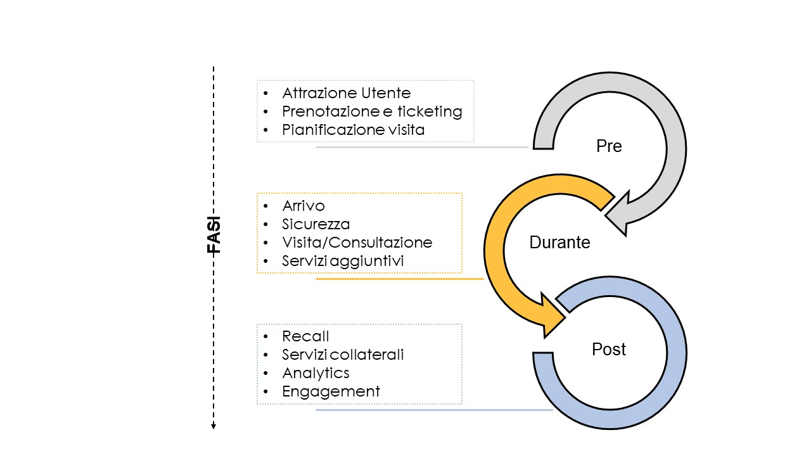

.. _processo_4:

Processo 4 \| User journey nei luoghi della cultura
===================================================

Per esaminare i processi sottostanti lo *user journey* nei luoghi della
cultura è opportuno rammentare che può realizzarsi sia in una dimensione
fisica (es. visita in situ a un museo) che digitale (es. navigazione del
sito di una biblioteca, fruizione di un prodotto editoriale realizzato a
partire dal riuso dei contenuti digitali, ecc.). Ciò premesso,
l’approccio metodologico delinea l’esperienza dell’utente/visitatore
finale in un’analisi strutturata in tre macro fasi (pre-visita, durante
la visita e post-visita), al fine di supportare i luoghi della cultura
nell’identificazione delle opportunità da cogliere e delle lacune da
colmare nella gestione dell’esperienza dell’utente-visitatore.

Di seguito sono rappresentate le fasi dei processi sottostanti lo *user
journey*, distinguendo ciò che accade prima, durante e dopo la visita.

|image0|

*Figura 7. Mappatura dei processi relativi allo user journey*

Di seguito sono descritte con maggior dettaglio le fasi del processo
relativo al momento pre-visita. Particolare attenzione andrà messa nella
pianificazione delle attività e dei servizi utili a semplificare e
facilitare le modalità di contatto con i luoghi della cultura da
visitare/frequentare, avendo cura di fornire online informazioni chiare,
esaurienti e pertinenti. Il sito web dell’istituto è quindi centrale per
la gestione della fase pre-visita dello *user journey*.

+-------------------+------------------+-------------------------+
| **Attrazione      | **Prenotazione e | **Pianificazione        |
| utente**          | ticketing**      | visita**                |
|                   |                  |                         |
+===================+==================+=========================+
| -  Progettazione  | -  Prenotazione  | -  Informazioni         |
|    sito web       |    accesso       |    su come              |
|    (info su       |                  |    è                    |
|    accessibilità, | -  Prenotazione  |    strutturato          |
|    info su        |    servizi       |    il                   |
|    collezioni,    |    aggiuntivi    |    percorso             |
|    info su        |                  |    di                   |
|    servizi)       | -  Acquisto      |    visita o             |
|                   |    titolo        |    come è               |
| -  Campagne       |    di            |    organizzata          |
|    di             |    ingresso      |    la sala              |
|    promozione     |                  |    studio               |
|                   |                  |                         |
| -  Servizi        |                  | -  Servizi              |
|    di             |                  |    per                  |
|    supporto       |                  |    simulare             |
|    all’utente     |                  |    la                   |
|    (help          |                  |    visita               |
|    desk,          |                  |    (virtual             |
|    chatbot,       |                  |    tour)                |
|    ecc.)          |                  |                         |
|                   |                  | -  Servizi              |
| -  Profilazione   |                  |    di                   |
|    utenti         |                  |    supporto             |
|                   |                  |    logistico            |
| -  Gestione       |                  |    (come                |
|    dati           |                  |    arrivare             |
|    utenti         |                  | ,                       |
|                   |                  |    parcheggi,           |
| -  Definizione    |                  |    ecc.)                |
|    dei            |                  |                         |
|    diritti        |                  | -  Invio                |
|    e dei          |                  |    suggerimenti         |
|    termini        |                  |    di                   |
|    d’uso          |                  |    visita/consultazione |
|    sui            |                  |    in base              |
|    nuovi          |                  |    al                   |
|    contenuti      |                  |    profilo              |
|    prodotti       |                  |    utente               |
|                   |                  |                         |
| -  Definizione    |                  | -  | Invio              |
|    del            |                  |      suggerimenti       |
|    sistema        |                  |      di                 |
|    di             |                  |      fruizione          |
|    gestione       |                  |    | e/o                |
|    dei            |                  |      acquisto           |
|    diritti        |                  |      di                 |
|                   |                  |      attività/servizi   |
|                   |                  |      aggiuntivi         |
|                   |                  |      (visite            |
|                   |                  |      guidate,           |
|                   |                  |      proiezioni,        |
|                   |                  |      servizio           |
|                   |                  |      di                 |
|                   |                  |      reference          |
|                   |                  |      online)            |
+-------------------+------------------+-------------------------+

*Figura 8. Mappatura dei processi relativi allo user journey – Pre
visita*

Durante la visita i prodotti e i servizi digitali che possono essere
offerti per migliorare l’esperienza sono molteplici; dal punto di vista
del processo, va posta attenzione alla componente infrastrutturale
(connettività, WIFI, sensoristica), invisibile all’utente ma essenziale
per accedere ai servizi; altro fattore da presidiare sin dalla
programmazione è la sicurezza dei dati personali degli utenti. Di
seguito sono descritte tutte le fasi del processo per la creazione dei
servizi dello *user journey* durante la visita.

+---------------------+--------------------+-------------------+--------------------+
| **Arrivo**          | **Infrastrutture** | **Visita          | **Servizi          |
|                     |                    | consultazione**   | collaterali**      |
+=====================+====================+===================+====================+
| -  Gestione         | -  Controllo       | -  Offerta di     | -  Abilitazione    |
|    accessi          |    sicurezza,      |    servizi        |    all’accesso     |
|                     |    antifurto,      |    “core”         |    al catalogo     |
| -  Indicazione      |    capienza per    |    (visita,       |    di              |
|    di servizi,      |    sala            |    prestito,      |    prestito /      |
|    percorsi e       |                    |    consultazione, |    acquisto        |
|    aree             | -  Tracciamento    |    etc.)          |                    |
|    funzionali       |    dei flussi      |                   | -  Formalizzazione |
|                     |    degli           | -  Offerta        |    acquisto,       |
| -  Acquisto,        |    utenti          |    contenuti /    |    spedizione,     |
|    emissione,       |                    |    percorsi       |    consegna o      |
|    controllo        | -  Gestione        |    personalizzati |    download        |
|    titolo di        |    emergenze       |                   |    prestiti /      |
|    ingresso         |    (furto,         |    in base alla   |    acquisti        |
|                     |    incendio)       |    profilazione   |                    |
| -  Consegna         |    e               |    dell’utente    | -  Offerta di      |
|    device di        |    assistenza      |                   |    suggerimenti    |
|    accompagnamento  |    sanitaria       | -  Abilitazione   |    di              |
|                     |                    |    al             |    approfondimento |
| -  Invio            | -  Offerta di      |    salvataggio    |    dei             |
|    suggerimenti     |    servizi         |    e download     |    contenuti,      |
|    di               |    collaterali     |    dei            |    di acquisto     |
|    visita /         |    (abilitazione   |    contenuti      |    attività e      |
|    consultazione /  |    Wi-Fi,          |    preferiti      |    servizi         |
|    attività         |    utilizzo        |                   |    extra           |
|    extra in         |    infrastrutture  | -  Abilitazione   |    complementari   |
|    base alla        |    tecnologiche,   |    all’upload     |                    |
|    profilazione     |    etc.)           |    dei            |                    |
|    dell’utente      |                    |    contenuti,     |                    |
|                     |                    |    validazione    |                    |
|                     |                    |    e              |                    |
|                     |                    |    pubblicazione  |                    |
|                     |                    |    degli          |                    |
|                     |                    |    stessi         |                    |
|                     |                    |                   |                    |
|                     |                    | -  Offerta di     |                    |
|                     |                    |    esperienze     |                    |
|                     |                    |    di             |                    |
|                     |                    |    gaming/contest |                    |
+---------------------+--------------------+-------------------+--------------------+

*Figura 9. Mappatura dei processi relativi allo user journey – Durante
la visita*

Altrettanto importante per la fidelizzazione degli utenti è la gestione
delle attività post-visita. In questa fase del processo è necessario
dotarsi di tecnologie e applicazioni per analizzare i dati
comportamentali, le preferenze e i giudizi degli utenti, altrimenti i
servizi realizzati potrebbero essere inefficaci o poco ingaggianti.
Inoltre si dovranno scegliere con accuratezza le applicazioni e i
servizi che consentono di coinvolgere gli utenti in attività in cui
possano avere un ruolo attivo, pur non essendo più fisicamente presenti
(tipicamente i servizi ad alto valore aggiunto). Di seguito sono
descritte nel dettaglio le fasi del processo post-visita.

+--------------------+------------------------+--------------------+---------------------+
| **Recall**         | **Servizi              | **Analytics**      | **Engagement**      |
|                    | collaterali**          |                    |                     |
|                    |                        |                    |                     |
+====================+========================+====================+=====================+
| -  Offerta         | -  Offerta             | -  Analisi         | -  Coinvolgimento   |
|    di              |    di                  |    delle           |    nelle            |
|    contenuti       |    suggerimenti        |    preferenze      |    attività         |
|    che             |    d’acquisto/prestito |    e               |    dell’istituzione |
|    ripropongono    |                        |    delle           |    culturale        |
|    l’esperienza    | -  Offerta             |    abitudini       |    (fundraising,    |
|                    |    di                  |    per             |    crowdfunding)    |
| -  Offerta         |    scontistica         |    target          |                     |
|    di              |    su                  |                    | -  Offerta          |
|    suggerimenti    |    acquisti,           | -  Analisi         |    di               |
|    di              |    prestiti            |    dei             |    membership       |
|    approfondimento |    multipli,           |    tempi           |    o                |
|    dei             |    nuovi               |    di              |    abbonamento      |
|    contenuti,      |    prestiti            |    visita          |                     |
|    di              |    disponibili         |    e               |                     |
|    acquisto        |                        |    consultazione   |                     |
|    attività        | -  Abilitazione        |    degli           |                     |
|    e               |    all’accesso         |    utenti          |                     |
|    servizi         |    al                  |                    |                     |
|    extra           |    catalogo            | -  Analisi         |                     |
|                    |    di                  |    dei             |                     |
| -  Abilitazione    |    prestito/acquisto   |    contenuti       |                     |
|    utente          |                        |    fruiti          |                     |
|    all’interazione | -  Abilitazione        |    e               |                     |
|    con             |    e                   |    consultati      |                     |
|    i               |    formalizzazione     |    dagli           |                     |
|    contenuti       |    pagamento           |    utenti          |                     |
|    (user           |    prestiti            |                    |                     |
|    generated       |                        | -  Analisi         |                     |
|    content)        | -  Spedizione,         |    di              |                     |
|                    |    consegna            |    prestiti        |                     |
| -  Abilitazione    |    o                   |    e               |                     |
|    pubblicazione   |    download            |    acquisti        |                     |
|    feedback        |    prestiti/acquisti   |    effettuati      |                     |
|    utente          |                        |                    |                     |
|                    | -  Assistenza          | -  Analisi         |                     |
|                    |    all’utente          |    dell’engagement |                     |
|                    |    e                   |    sui             |                     |
|                    |    reclami             |    social          |                     |
|                    |                        |    media           |                     |
+--------------------+------------------------+--------------------+---------------------+

*Figura 10. Mappatura dei processi relativi allo user journey – Post
visita*

In conclusione, nel disegnare lo *user journey* sarà necessario prendere
in considerazioni tutte le fasi del processo, anche se affrontate con
servizi digitali minimali; diversamente, scegliere da un catalogo di
servizi cosa implementare senza aver chiaro l’intero processo può
vanificare l’efficacia del servizio realizzato/acquistato.

