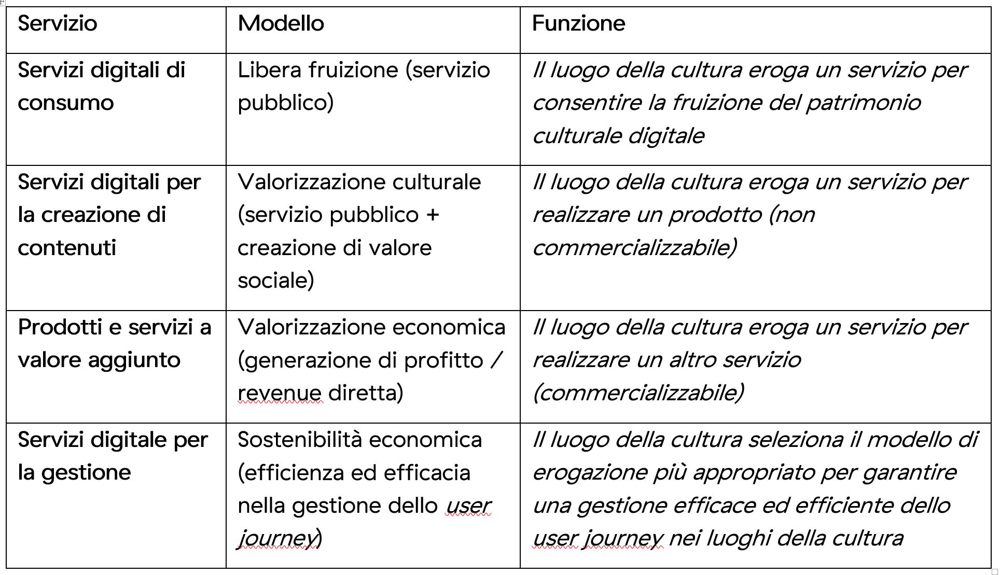

Possibili modelli di gestione
=============================

Sulla base dei processi *end-to-end* individuati (cfr. cap. 3) e dei
servizi digitali erogabili (cfr. cap. 4), è possibile adottare modelli
di gestione capaci di armonizzare l’apertura inclusiva e democratica
delle collezioni con gli scopi di valorizzazione, anche economica, del
patrimonio culturale digitalizzato. L’obiettivo strategico è la
proposizione di modelli di gestione sostenibili nel tempo.

A tal fine sono stati considerati i principali modelli di gestione
applicabili al sistema culturale italiano, attingendo ad esempi, buone
pratiche e casi afferenti settori economici diversi, sulla base dei
quali sono stati definiti i modelli adatti a ciascun cluster di servizi,
associati di volta in volta ai relativi macro-processi.

Questo approccio metodologico propone l’adozione di modelli di gestione
ideali per la valorizzazione del patrimonio culturale digitalizzato, nel
rispetto delle caratteristiche e delle funzioni distintive dei cluster
dei prodotti e dei servizi individuati.

**Tabella 5.**\ *Schema di sintesi: modelli di gestione per tipologia di
servizi*

|image0|

.. toctree::
  :maxdepth: 3
  :caption: Indice dei contenuti

  possibili-modelli-di-gestione/processo-1---servizi-di-consumo---modello-a-libera-fruizione..rst
  possibili-modelli-di-gestione/processo-2---servizi-per-la-creazione-di-contenuti---modello-a-valorizzazione-culturale..rst
  possibili-modelli-di-gestione/processo-3-prodotti-e-servizi-a-valore-aggiunto-modello-a-valorizzazione-economica.rst
  possibili-modelli-di-gestione/processo-4-user-journey-nei-luoghi-della-cultura-1.rst

