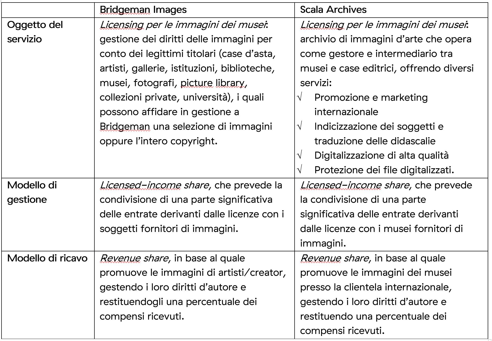
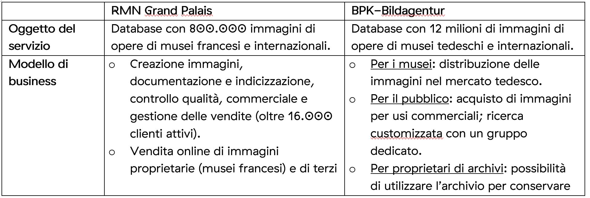
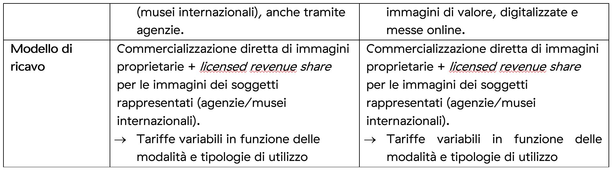

5.3. Processo 3 – Prodotti e servizi a valore aggiunto – Modello a valorizzazione economica
============================================================================================

Oggetto del presente paragrafo sono i *Prodotti e servizi a valore
aggiunto*, derivanti dal processo mediante il quale i luoghi della
cultura e/o gli utenti utilizzano i contenuti digitali e li rielaborano
con un valore aggiunto per finalità espositive, educative, editoriali e
commerciali (cfr. par. 4.3).

In particolare, in questa sede appare opportuno considerare le politiche
fondate sul concetto di “servizio” piuttosto che sulla tradizionale e
anacronistica nozione di “prodotto”, consentendo alle istituzioni
culturali di governare il processo di riuso a fini commerciali in
funzione degli obiettivi prefissati, e nello specifico: i) massimizzare
la diffusione del patrimonio culturale digitalizzato, e ii) ottenere
ricavi derivanti dalla valorizzazione economica per finalità commerciali
dei contenuti digitali.

Schematicamente possiamo individuare tre modelli di valorizzazione
economica per l’uso e il riuso dei contenuti culturali:

1. Ricavi derivanti dalla concessione/vendita delle riproduzioni dei
   beni culturali;

2. Ricavi derivanti dalla concessione/vendita dei contenuti creativi
   generati a partire dai dati messi a disposizione dai luoghi della
   cultura;

3. Ricavi generati dall’accesso a prodotti e servizi di fruizione.

Il primo modello (a) è quello maggiormente utilizzato dalle istituzioni
culturali, dal momento che ricorre a una modalità tradizionale di
valorizzazione economica: prevede la corresponsione di un corrispettivo
economico a fronte della facoltà di utilizzare la riproduzione digitale
di un bene culturale [19]_. Questa modalità è la più utilizzata dai
luoghi della cultura, dal momento che non presenta particolari
complessità – se non organizzative – nella sua attuazione. Tuttavia, le
opportunità di questo modello di gestione sono maggiori quanto più è
ricco, variegato e aggregato il sistema di offerta; si pensi a titolo
esemplificativo al successo delle banche immagini internazionali (*image
banks*), specializzate nella gestione dei diritti d’autore e delle
licenze d’uso di fotografie storiche, riproduzioni di opere d’arte e
materiali audiovisivi (i.e. Bridgeman Images, Scala Archives,
Photoservice Electa). Ma anche in ambito pubblico spiccano gli esempi
francesi e tedeschi: oltralpe e in Germana esistono da anni agenzie
governative preposte alla gestione centralizzata della vendita dei
diritti sulle immagini di beni culturali.

Si riporta, di seguito, un confronto tra le strategie di licensing di
una selezione di soggetti internazionali (banche immagini private e
agenzie nazionali) (Tabelle 6, 7).

**Tabella 6.**\ *Strategie di licensing di due banche immagini private –
Bridgeman Images VS Scala Archives*

|image0|

**Tabella 7.**\ *Strategie di licensing di due agenzie nazionali – RMN
Grand Palais*\ [20]_ *VS BPK-Bildagentur*\ [21]_

|image1|

|image2|

Un’evoluzione di tale modello è rappresentata dai soggetti che accanto
alle immagini commercializzano anche i diritti d’uso di tutti i
contenuti creativi sviluppati da un’ampia moltitudine di
autori/contributori (b) (si pensi al caso di Getty Images), con logiche
pressoché identiche.

Come è noto, queste società globali – analogamente alle aziende che
pubblicano i contenuti dei cosiddetti *creators* (dagli youtuber agli
instragrammer) – gestiscono i diritti sulle immagini, sui video, sugli
audio e sugli scatti fotografici (completi di metadati) con modelli di
*revenue share* che prevedono la retrocessione di una percentuale del
prezzo di vendita dei file commercializzati ai singoli luoghi della
cultura (musei, biblioteche e archivi), agli artisti e ai creativi
proprietari delle opere riprodotte.

In pratica le società commercializzano le riproduzioni digitali e le
relative licenze d’uso (*rights management*) gestendo
immagini/audio-video/banche dati [22]_, in cui buona parte dei processi
di distribuzione e intermediazione (dalla richiesta dei preventivi
all’emissione dei contratti, sino ai pagamenti) è automatizzata e
gestita attraverso canali e soluzioni digitali.

Difficilmente questo modello può essere adottato da un singolo istituto,
dal momento che l’attrattività per l’utente è rappresentata dalla
quantità, varietà e qualità dei contenuti disponibili; andrebbe semmai
valutata - come alternativa non esclusiva all’aggregazione a un soggetto
pubblico - l’ipotesi di siglare accordi con le grandi società che
veicolano contenuti a pagamento, avendo cura di valutare con attenzione
ogni clausola del contratto di servizio affinché sia bilanciata
l’inevitabile asimmetria informativa e sia assicurato l’interesse
pubblico dell’operazione.

Di seguito, a titolo esemplificativo, si schematizza il modello di
business della società Getty Images, che a riguardo può essere
considerato un caso gestionale esemplare:

**Tabella 8.**\ *Strategie di licensing: Getty Images*

+-----------------------------------+-----------------------------------+
|                                   | **Getty Images**                  |
+===================================+===================================+
| **Oggetto del servizio**          |    Creative Royalty               |
|                                   |    Free `<https://www.gettyimages.|
|                                   |it/solutions/it/creative>`__\:     |
|                                   |    Immagini e video “creative”    |
|                                   |    che non prevendono il          |
|                                   |    pagamento di *royalty*,        |
|                                   |    provenienti da oltre 75.000    |
|                                   |    contributor internazionali.    |
|                                   |    Uso commerciale.               |
|                                   |                                   |
|                                   | -  `Editorial <https://www.gettyi |
|                                   | mages.it/editorial-images>`__\ *: |
|                                   | *                                 |
|                                   |    Immagini e video protetti da   |
|                                   |    copyright), prodotti da        |
|                                   |    fotoreporter internazionali    |
|                                   |    pluripremiati. Temi: news,     |
|                                   |    sport, entertainment. Uso      |
|                                   |    editoriale.                    |
|                                   |                                   |
|                                   | -  `Getty Images                  |
|                                   |    Music: <https://www.gettyimage |
|                                   | s.it/about-music>`__              |
|                                   |    Grazie alla collaborazione con |
|                                   |    Epidemic Sound, gli utenti     |
|                                   |    accedono a 30.000 tracce       |
|                                   |    musicali e 60.000 effetti      |
|                                   |    sonori (incluse tracce stem).  |
|                                   |    Questi contenuti audio non     |
|                                   |    sono disponibili altrove e     |
|                                   |    sono liberi da copyright.      |
+-----------------------------------+-----------------------------------+
| **Modello di business**           | *Licensed-income share*, che      |
|                                   | prevede che i                     |
|                                   | `contributors <https://www.gettyi |
|                                   | mages.it/workwithus>`__           |
|                                   | (detentori del copyright)         |
|                                   | carichino contenuti per i quali   |
|                                   | ricevono una *royalty* nel        |
|                                   | momento in cui un cliente         |
|                                   | acquista una licenza.             |
+-----------------------------------+-----------------------------------+
| **Modello di ricavo**             | -  `Licenze                       |
|                                   |    individuali <https://www.getty |
|                                   | images.it/piani-e-prezzi>`__:     |
|                                   |    per singole immagini ricercate |
|                                   |    dagli utenti (piccole, medie,  |
|                                   |    grandi dimensioni); prezzi dai |
|                                   |    175 ai 475 euro per download.  |
|                                   |                                   |
|                                   | -  `Pacchetti di                  |
|                                   |    licenze <https://www.gettyimag |
|                                   | es.it/piani-e-prezzi>`__:         |
|                                   |    immagini disponibili da 5 o 10 |
|                                   |    download (piccole, medie,      |
|                                   |    grandi dimensioni). Con il     |
|                                   |    pacchetto, il download di      |
|                                   |    un’immagine costa meno         |
|                                   |    rispetto all’opzione con       |
|                                   |    licenza individuale.           |
|                                   |                                   |
|                                   | -  `Premium                       |
|                                   |    Access <https://www.gettyimage |
|                                   | s.it/solutions/it/premium-access> |
|                                   | `__:                              |
|                                   |    piano che consente di accedere |
|                                   |    a Getty Images e iStock,       |
|                                   |    caratterizzato da massima      |
|                                   |    flessibilità, download e       |
|                                   |    accessi illimitati.            |
|                                   |                                   |
|                                   | -  `Getty Images                  |
|                                   |    Music: <https://www.gettyimage |
|                                   | s.it/about-music>`__              |
|                                   |    usufruibile con il piano       |
|                                   |    Premium Access, previo         |
|                                   |    pagamento di una quota, con    |
|                                   |    cui si accede al download di   |
|                                   |    tutti i contenuti audio.       |
|                                   |                                   |
|                                   | -  `Custom                        |
|                                   |    Solutions: <https://www.gettyi |
|                                   | mages.it/solutions/it/custom-solu |
|                                   | tions>`__                         |
|                                   |    possibilità di creare una      |
|                                   |    libreria di contenuti          |
|                                   |    personalizzati e di prenotare  |
|                                   |    un servizio su misura, con la  |
|                                   |    collaborazione degli oltre     |
|                                   |    300.000 creativi da tutto il   |
|                                   |    mondo di Getty Images e iStock |
|                                   |                                   |
|                                   | -  Strumenti e integrazioni per   |
|                                   |    ottimizzare il lavoro:         |
|                                   |                                   |
|                                   | -  Plug-in ed estensioni:         |
|                                   |    integrazione intelligente con  |
|                                   |    Dropbox, Wordpress, InVision,  |
|                                   |    e altro ancora                 |
|                                   |                                   |
|                                   | -  Media Manager (Brandfolder):   |
|                                   |    sistema di gestione dei file   |
|                                   |    basato sull’AI, facile da      |
|                                   |    utilizzare, personalizzabile e |
|                                   |    altamente affidabile           |
|                                   |                                   |
|                                   | -  Integrazione con Adobe         |
|                                   |    Creative Cloud: ricerca di     |
|                                   |    immagini e video senza uscire  |
|                                   |    dal programma di design        |
|                                   |                                   |
|                                   | -  API intuitivo e potente:       |
|                                   |    grazie alla completa           |
|                                   |    integrazione delle app, i      |
|                                   |    contenuti e l’esperienza di    |
|                                   |    Getty Images sono a            |
|                                   |    disposizione degli utenti      |
|                                   |                                   |
|                                   | -  `iStock Affiliates             |
|                                   |    Program <https://affiliates.ge |
|                                   | ttyimages.com/>`__:               |
|                                   |    una API personalizzabile       |
|                                   |    consente ai proprietari di     |
|                                   |    altri siti web di mostrare     |
|                                   |    facilmente e dinamicamente i   |
|                                   |    contenuti di iStock ai loro    |
|                                   |    utenti, guadagnano commissioni |
|                                   |    quando l’utente effettua un    |
|                                   |    acquisto.                      |
+-----------------------------------+-----------------------------------+
| **Altri servizi**                 | Servizi che prevedono funzioni    |
|                                   | destinate a target diversi e più  |
|                                   | ampi, caratterizzati da prezzi    |
|                                   | più accessibili ed una maggiore   |
|                                   | libertà d’utilizzo dei contenuti: |
|                                   |                                   |
|                                   | -  `iStock <https://www.istockpho |
|                                   | to.com/it>`__:                    |
|                                   |    contenuti stock a tariffe      |
|                                   |    convenienti per uso            |
|                                   |    commerciale.                   |
|                                   |                                   |
|                                   | -  `Unsplash <https://unsplash.co |
|                                   | m/license>`__:                    |
|                                   |    contenuti disponibili          |
|                                   |    gratuitamente                  |
|                                   |                                   |
|                                   | -  `Photos.com <https://photos.co |
|                                   | m/>`__:                           |
|                                   |    offre una selezione curata di  |
|                                   |    fotografie pronte da appendere |
|                                   |    con una serie di opzioni di    |
|                                   |    incorniciatura.                |
+-----------------------------------+-----------------------------------+

Accanto ai due precedenti modelli di gestione, fondati sulla
concessione/commercializzazione di immagini e contenuti (*Licensing*),
nella tabella seguente sono descritti ulteriori modelli di
valorizzazione economica (c) che possono essere applicati ai diversi
cluster di prodotti e servizi illustrati in precedenza (cfr. cap. 4) e
nello specifico:

-  **Libera Fruizione**: il modello prevede un accesso libero e
   gratuito, con la possibilità di riutilizzare i contenuti digitali per
   fini non direttamente commerciali, in funzione degli scopi intrinseci
   di accessibilità e apertura inclusiva rispetto ai contenuti messi a
   disposizione dai luoghi della cultura.

-  **Licensing**: modello tradizionale di valorizzazione economica, che
   comporta il versamento di un corrispettivo monetario a fronte della
   facoltà di utilizzare un bene o un servizio digitale.

-  **Open licensing**: modello “a licenza aperta”, che consente agli
   utenti di utilizzare gratuitamente e liberamente un prodotto o un
   servizio digitale, a seconda della licenza Creative Commons vigente,
   anche generando opere derivate o *User Generated Content*.

-  **Freemium**: modello con due o più varianti qualitative del prodotto
   da distribuire (o del servizio da erogare) a prezzi differenziati:
   viene messa gratuitamente a disposizione la versione base del
   prodotto/servizio (*free*), mentre per usufruire delle versioni
   superiori (*premium*), che includono funzioni aggiuntive, l'utente
   deve corrispondere importi correlati al loro valore scalare.

-  **Membership**: modello commerciale a lungo termine, il cui obiettivo
   primario è la creazione di una relazione duratura tra utente e
   organizzazione: gli utenti versano un determinato importo,
   sottoscrivendo un programma di membership (perciò il modello è detto
   anche “subscription”), per diventare membri di un’organizzazione.

-  **Pay-per-view**: modello alternativo al precedente, che consente
   agli utenti di fruire di un prodotto o servizio accedendo a singoli
   contenuti a pagamento, senza necessariamente acquistare un pacchetto
   o sottoscrivere un abbonamento.

-  **Free market**: con questa espressione si intende un modello basato
   sull’equilibrio tra domanda e offerta definito dalle dinamiche di
   un’economia di mercato, nel nostro caso con riferimento a due mercati
   specifici: quello degli NFTs e quello delle Digital Copies.

**Tabella 9.**\ *Ipotesi di modelli di gestione per cluster di
prodotti/servizi*

+-----------------------------------+-----------------------------------+
| **CLUSTER**                       | **MODELLO DI GESTIONE**           |
+===================================+===================================+
| **Banche dati**                   | -  **Banche dati tematiche: OPEN  |
|                                   |    LICENSING**: gli utenti        |
|                                   |    accedono gratuitamente alle    |
|                                   |    media libraries e possono      |
|                                   |    riutilizzare i contenuti       |
|                                   |    liberamente, a seconda della   |
|                                   |    licenza Creative Commons       |
|                                   |    vigente, anche generando opere |
|                                   |    derivate o *User Generated     |
|                                   |    Content.*                      |
|                                   |                                   |
|                                   | *Reference: The Metropolitan      |
|                                   | Museum of Art*\  [23]_            |
|                                   |                                   |
|                                   | -  **Banche dati di servizio** e  |
|                                   |    **Big data: FREEMIUM,** con 3  |
|                                   |    tipologie di servizi:          |
|                                   |                                   |
|                                   | a) Accesso limitato: servizio di  |
|                                   |    base, limitato (no download,   |
|                                   |    no riutilizzo), ad-supported   |
|                                   |    (supportato da inserimenti     |
|                                   |    pubblicitari) e gratuito       |
|                                   |    (*free*);                      |
|                                   |                                   |
|                                   | b) Abbonamento: servizio ad       |
|                                   |    accesso illimitato e a         |
|                                   |    pagamento, declinato in varie  |
|                                   |    formule a seconda dei diversi  |
|                                   |    parametri di utilizzo (formule |
|                                   |    *premium*);                    |
|                                   |                                   |
|                                   | c) Pay per view: possibilità di   |
|                                   |    accedere a pagamento a singoli |
|                                   |    contenuti.                     |
|                                   |                                   |
|                                   | *Reference: Interpol (Stolen      |
|                                   | works of art                      |
|                                   | database*\  [24]_\ *),            |
|                                   | ArchINFORM*\  [25]_\ *,           |
|                                   | ICONEM*\  [26]_\ *, National      |
|                                   | Center for Arts and Research      |
|                                   | (DataArts)*\  [27]_\ *,           |
|                                   | Artprice*\  [28]_\ *, Bridgeman   |
|                                   | Images*\  [29]_\ *, Getty         |
|                                   | Images*\  [30]_\ *,               |
|                                   | Spotify*\  [31]_                  |
|                                   |                                   |
|                                   | **Servizi di crowdsourcing:       |
|                                   | LIBERA FRUIZIONE + MEMBERSHIP**   |
|                                   |                                   |
|                                   | *Reference: V&A Museum            |
|                                   | (Deciphering                      |
|                                   | Dickens)*\  [32]_\ *,             |
|                                   | Patreon*\  [33]_                  |
+-----------------------------------+-----------------------------------+
| **Prodotti espositivi**           | -  **Digital travelling           |
|                                   |    exhibitions: LICENSING**       |
|                                   |                                   |
|                                   | *Reference: Smithsonian           |
|                                   | Institution Traveling Exhibition  |
|                                   | Service (SITES)*\  [34]_          |
|                                   |                                   |
|                                   | -  **Virtual tour: LIBERA         |
|                                   |    FRUIZIONE**                    |
|                                   |                                   |
|                                   | *Reference: Getty Museum -        |
|                                   | Xplorit*\  [35]_                  |
|                                   |                                   |
|                                   | -  **Online guided tour: PAY PER  |
|                                   |    VIEW**                         |
|                                   |                                   |
|                                   | *Reference: Guggenheim New        |
|                                   | York*\  [36]_\ *, Clio Muse       |
|                                   | Tours*\  [37]_                    |
+-----------------------------------+-----------------------------------+
| **Prodotti educativi**            | -  **FREEMIUM,** con 3 tipologie  |
|                                   |    di servizi:                    |
|                                   |                                   |
|                                   | a) Accesso limitato: servizio di  |
|                                   |    base, limitato (no download,   |
|                                   |    no riutilizzo), ad-supported   |
|                                   |    (supportato da inserimenti     |
|                                   |    pubblicitari) e gratuito       |
|                                   |    (*free*);                      |
|                                   |                                   |
|                                   | b) Abbonamento: servizio ad       |
|                                   |    accesso illimitato e a         |
|                                   |    pagamento, declinato su 2      |
|                                   |    piani *premium*: per singolo   |
|                                   |    programma (quota mensile       |
|                                   |    variabile per programma) o per |
|                                   |    pacchetti di corsi/programmi   |
|                                   |    (quota mensile/annuale fissa); |
|                                   |                                   |
|                                   | c) Pay per view: possibilità di   |
|                                   |    accedere a pagamento a singoli |
|                                   |    contenuti.                     |
|                                   |                                   |
|                                   | *Reference: Coursera e            |
|                                   | MoMA*\  [38]_\ *, Van Gogh        |
|                                   | Museum*\  [39]_\ *, Natural       |
|                                   | History Museum*\  [40]_           |
+-----------------------------------+-----------------------------------+
| **Prodotti editoriali**           | -  **FREEMIUM,** con 3 tipologie  |
|                                   |    di servizi:                    |
| **(publishing)**                  |                                   |
|                                   | a) Accesso limitato: servizio di  |
|                                   |    base, limitato (no download,   |
|                                   |    no riutilizzo), ad-supported   |
|                                   |    (supportato da inserimenti     |
|                                   |    pubblicitari) e gratuito       |
|                                   |    (*free*);                      |
|                                   |                                   |
|                                   | b) Abbonamento: servizio ad       |
|                                   |    accesso illimitato e a         |
|                                   |    pagamento, declinato in varie  |
|                                   |    formule a seconda dei diversi  |
|                                   |    parametri di utilizzo (formule |
|                                   |    *premium*);                    |
|                                   |                                   |
|                                   | c) Pay per view: possibilità di   |
|                                   |    accedere a pagamento a singoli |
|                                   |    contenuti.                     |
|                                   |                                   |
|                                   | *Reference: Audible*\  [41]_\ *,  |
|                                   | Kindle*\  [42]_\ *, Guggenheim    |
|                                   | New York*\  [43]_\ *, British     |
|                                   | Museum*\  [44]_                   |
+-----------------------------------+-----------------------------------+
| **Prodotti commerciali –**        | -  **LICENSING “PURO”**           |
|                                   |                                   |
| **Advertising**                   | *Reference: KelOptic*\  [45]_     |
+-----------------------------------+-----------------------------------+
| **Prodotti commerciali –**        | -  **LICENSING “PURO”**           |
|                                   |                                   |
| **Merchandising**                 | *Reference: Van Gogh              |
|                                   | Museum-Manduka*\  [46]_           |
+-----------------------------------+-----------------------------------+
| **Prodotti commerciali –**        | -  **FREE MARKET**, con 2         |
|                                   |    tipologie di servizi:          |
| **Collectables**                  |                                   |
|                                   |    a. Modello NFTs: Utilizzo di   |
|                                   |       una piattaforma online      |
|                                   |       (*marketplace* su modello   |
|                                   |       delle aste online) di       |
|                                   |       vendita, streaming e        |
|                                   |       download per beni digitali  |
|                                   |       da collezione               |
|                                   |       (*collectables*) protetti   |
|                                   |       da tecnologia *blockchain*  |
|                                   |       (videoarte, digital art,    |
|                                   |       NFTs, etc.).                |
|                                   |                                   |
|                                   | *Reference: Sedition*\  [47]_\ *, |
|                                   | OpenSea*\  [48]_\ *, Whitworth    |
|                                   | Art Gallery*\  [49]_\ *,          |
|                                   | Hermitage*\  [50]_                |
|                                   |                                   |
|                                   | b. Modello Digital Copies:        |
|                                   |    Creazione, da parte di un      |
|                                   |    soggetto terzo, di             |
|                                   |    riproduzioni digitali del      |
|                                   |    patrimonio culturale, prodotte |
|                                   |    in serie limitata e in forma   |
|                                   |    non fungibile, i cui proventi  |
|                                   |    delle vendite vengono          |
|                                   |    condivisi con il luogo della   |
|                                   |    cultura detentore dei diritti, |
|                                   |    secondo un modello di *revenue |
|                                   |    share*.                        |
|                                   |                                   |
|                                   | *Reference:                       |
|                                   | LaCollection*\  [51]_\ *,         |
|                                   | Cinello*\  [52]_                  |
+-----------------------------------+-----------------------------------+

La Tabella 9 fornisce agli istituti un inquadramento dei modelli di
gestione applicabili a ciascun cluster di *Prodotti e servizi a valore
aggiunto* offerti per finalità espositive, educative, editoriali e
commerciali, prestando particolare attenzione al loro potenziale in
termini di diffusione del patrimonio culturale digitalizzato e di
massimizzazione dei ricavi propri.

In particolare, le tre tipologie di modelli di valorizzazione economica
per l’uso e il riuso dei contenuti culturali (cfr. pag. 27), descritti a
pag. 30, sono state declinate in funzione dei 7 cluster di
prodotti/servizi individuati.

Ciascun istituto, una volta chiariti gli obiettivi e identificate le
soluzioni applicabili, potrà scegliere i modelli di valorizzazione più
appropriati in funzione della propria condizione e delle opportunità che
si presentano.

.. [19] Questo è il modello che deriva dall’applicazione all’ambiente
   digitale degli art. 107 e 108 del Codice dei beni culturali.

.. [20] In Francia è stata creata nel 1946 l’agenzia fotografica Réunion des
   Musées Nationaux – Grand Palais (RMN), un’istituzione pubblica
   commerciale sotto l’autorità del Ministero della Cultura),
   ufficialmente responsabile della promozione delle collezioni dei
   musei nazionali francesi. Da più di 60 anni l’agenzia realizza
   campagne fotografiche e ora anche audiovisive all’interno dei musei
   nazionali, realizzando ogni anno oltre 20.000 nuovi scatti per
   espandere ulteriormente la collezione dell’agenzia, disponibile sul
   sito web.

.. [21] In Germania la BPK-Bildagentur (BPK) è un’impresa pubblica
   fornitrice di servizi media facente capo alla Fondazione Prussiana
   del Patrimonio Culturale (Stiftung Preußischer Kulturbesitz). Fondata
   nel 1966, attualmente la BPK offre tutti i servizi di una moderna
   media bank: con un archivio di oltre 12 milioni di fotografie,
   possiede una delle collezioni di foto storiche contemporanee più
   importanti d’Europa.

.. [22] Bisogna poi considerare che gli utenti professionali interessati ad
   utilizzare le immagini sono disposti a pagare per le licenze e i
   servizi aggiuntivi offerti, come la possibilità di ricercare le
   immagini e ottenere i metadati.

.. [23] https://www.metmuseum.org/blogs/digital-underground/2017/open-access-at-the-met

.. [24] https://www.interpol.int/en/Crimes/Cultural-heritage-crime/Stolen-Works-of-Art-Database

.. [25] https://www.archinform.net/index.mobi.htm

.. [26] https://iconem.com/en/

.. [27] https://culturaldata.org/smu-dataarts/about-dataarts/

.. [28] https://www.artprice.com/

.. [29] https://www.bridgemanimages.com/en/

.. [30] https://www.gettyimages.it/

.. [31] https://www.spotify.com/it/

.. [32] https://www.vam.ac.uk/research/projects/deciphering-dickens#overview

.. [33] https://www.patreon.com/

.. [34] https://www.sites.si.edu/s/

.. [35] https://www.xplorit.com/the-getty

.. [36] https://www.guggenheim.org/group-visits

.. [37] https://cliomusetours.com/

.. [38] https://www.coursera.org/moma

.. [39] https://www.vangoghmuseum.nl/en/art-and-stories/children

.. [40] https://www.nhm.ac.uk/schools/virtual-workshops.html

.. [41] https://www.audible.com/

.. [42] https://www.amazon.it/kindle-dbs/hz/subscribe/ku

.. [43] https://archive.org/details/guggenheimmuseum

.. [44] https://www.britishmuseum.org/research/publications/online-research-catalogues

.. [45] https://www.trendhunter.com/trends/keloptic

.. [46] https://www.vangoghmuseum.nl/en/about/collaborate/van-gogh-museum-brand-licenses/collaboration-license-partners/manduka-x-van-gogh-museum

.. [47] https://www.seditionart.com/

.. [48] https://opensea.io/

.. [49] https://whitworth.vastari.com/theancientofdaysnft

.. [50] `https://www.theartnewspaper.com/2021/09/13/we-have-no-doubt-nfts-are-art-after-selling-tokenised-leonardo-hermitage-plans-exhibition-of-born-digital-works. <https://www.theartnewspaper.com/2021/09/13/we-have-no-doubt-nfts-are-art-after-selling-tokenised-leonardo-hermitage-plans-exhibition-of-born-digital-works>`__

.. [51] https://lacollection.io/about/

.. [52] https://www.cinello.com/it/

